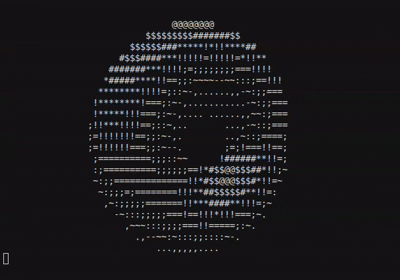

# Have a donut :D



# Overview

## English

Inspired by one of `Joma Tech` [youtube vieo](https://youtu.be/sW9npZVpiMI). I found it interesting and had urge to try it.

`Andy Sloan` was the original creatior of donut. [Blog post](https://www.a1k0n.net/2011/07/20/donut-math.html)

Few functions didn't work because those libraries no longer exists, so had to replace them with newer functions.

All the credit goes to 2 above.

## Korean

얼마전에 [유튜브 비디오](https://youtu.be/sW9npZVpiMI) 보다가 재밌기도 하고 궁금 하기도 해서 한번 따라해 본거에요.

[원본 코드](https://www.a1k0n.net/2011/07/20/donut-math.html) 를 그대로 돌리면 에러가 나더라고요. 

왜냐하면 쓰던 코드가 조금 오래되서 몇개 라이브러리 function 들이 더이상 support 되지 않아요.

그래서 한번 고쳐봤어요.

모든 Credit 은 원본 코드 만드신 분께 가요.

# Prerequisite

- cmake
- make


# Getting started

The CMake project compiles `src/donut.c` (and links `libm`) into an executable named like the project: `donut` on Unix, `donut.exe` on Windows. From the **repository root**:

1. **Configure** — generates `Makefile` (and related files) from `CMakeLists.txt`:

   ```bash
   cmake .
   ```

2. **Build** — compile and link:

   ```bash
   make
   ```

   Or run `./build.sh`, which runs `cmake .` then `make`.

Alternatively, without CMake:

```bash
gcc -Iinclude -o donut src/donut.c -lm
```

## Run the executable

### Windows

```bash
./donut.exe
```

### Linux / macOS

```bash
./donut
```

